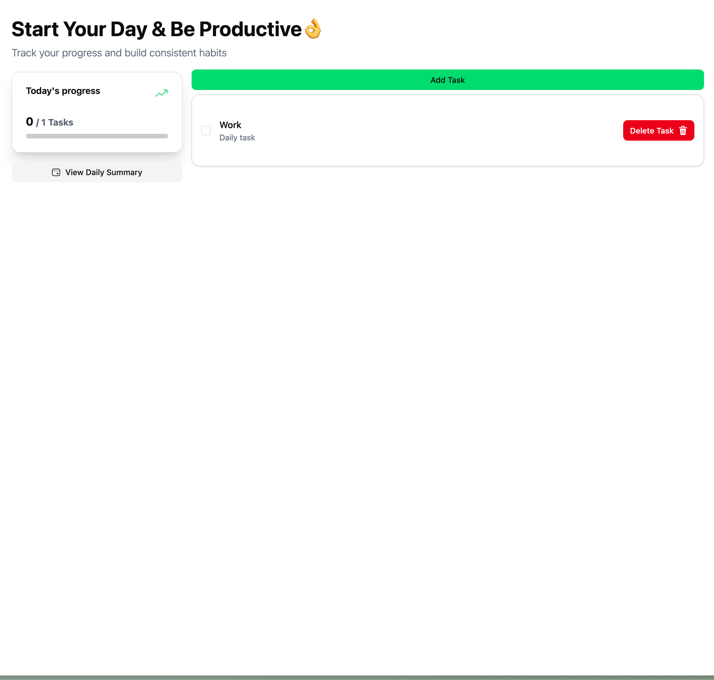

# 🌌 Task Manager: Deep Space Edition

> A premium, high-performance todo application built for productivity, featuring a "Deep Space" Glassmorphism aesthetic and seamless data persistence.

<p align="center">
  
</p>

---

## ✨ Features at a Glance

Task Manager combines sophisticated motion design with intuitive task management. Whether you're building habits or tracking deadlines, it scales with your needs.

### 📅 Smart Scheduling

- **One-Time Tasks**: Precise date selection for specific deadlines.
- **Daily Recurrence**: Build habits with tasks that reset every morning.
- **Specific Day Logic**: Plan your week by assigning tasks to specific days (e.g., Monday & Wednesday).

### 🎨 Premium UI/UX

- **Deep Space Glassmorphism**: High-end aesthetic using backdrop blurs and subtle gradients.
- **Interactive Motion**: Powered by `Framer Motion` for spring-based physics, layout transitions, and hover effects.
- **Custom Emojis**: Personalize every task with a built-in emoji selector.
- **Confetti Rewards**: Celebrate 100% completion with a vibrant interactive animation.

### 🛠️ Technical Excellence

- **React 19 & TypeScript**: Utilizing the latest React features and strict typing for reliability.
- **Radix UI Primitives**: Accessible, unstyled components (Dialogs, Checkboxes, Progress bars).
- **Intelligent Persistence**: Automatic data migration and daily summary snapshots stored in `localStorage`.
- **Derived State Engine**: Highly optimized Context API usage that calculates progress and views on-the-fly.

---

## 🚀 Technical Stack

| Category        | Technology                                        |
| :-------------- | :------------------------------------------------ |
| **Frontend**    | React 19, Vite, TypeScript                        |
| **Styling**     | Tailwind CSS v4, Glassmorphism Design System      |
| **Animation**   | Framer Motion (Spring Physics, Layout Animations) |
| **Components**  | Radix UI (Primitives), Lucide React (Icons)       |
| **State**       | React Context (with derived state patterns)       |
| **Persistence** | LocalStorage with Automated Migration Logic       |

---

## 🏃‍♂️ Getting Started

### Prerequisites

- [Node.js](https://nodejs.org/) (Latest LTS recommended)
- `npm`, `yarn`, or `pnpm`

### Installation

1. **Clone the repository**

   ```bash
   git clone https://github.com/KacperBartlomiejczak/rn-task-manager.git
   cd rn-task-manager
   ```

2. **Install dependencies**

   ```bash
   pnpm install
   ```

3. **Launch development server**

   ```bash
   pnpm run dev
   ```

4. **Navigate to** [http://localhost:5173](http://localhost:5173)

---

## 📂 Architecture

The project follows a modular architecture designed for scalability and maintainability.

```bash
src/
├── components/
│   ├── taskCard/     # Complex interactive task elements
│   ├── taskModal/    # Create & Edit flows
│   └── ui/           # Shared Radix UI & primitive atoms
├── context/          # TaskContext & Business Logic
├── lib/              # Utils, Constants, and Configuration
├── App.tsx           # Layout Orchestrator
└── App.css           # Global Design System (Variables & Glassmorphism)
```

---

## 🔮 Roadmap

- [ ] **Task Backlog**: Manage tasks without a set date.
- [ ] **Task Prioritization**: High, medium, and low priority levels.
- [ ] **Smart Reminders**: Browser notifications for scheduled tasks.
- [ ] **Cloud Sync**: Optional Firebase/Supabase integration for multi-device support.

---

<p align="center">
  Crafted with precision by <a href="https://github.com/KacperBartlomiejczak">Kacper Bartłomiejczak</a>
</p>
